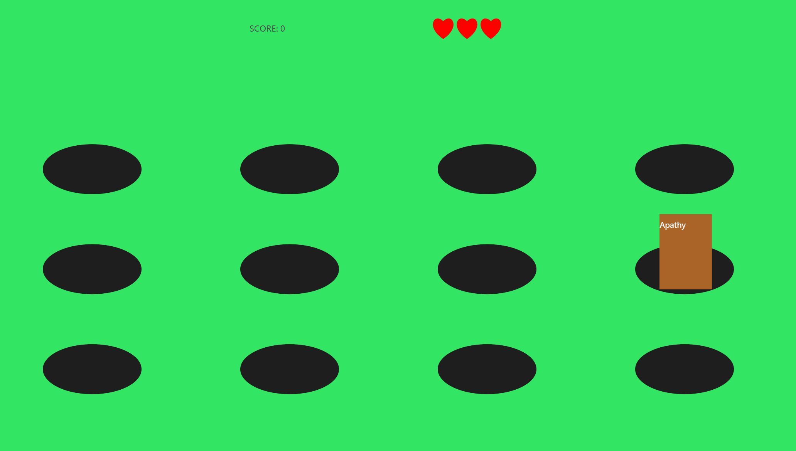

# Toolkits

## Team 4
| UID | Name |
| :---: | :----: |
| u7270388 | Bofeng Chen | 
| u7342936 | JuhaoTao | 
| u7344258 | Isaac Zhang |
| u7353648 | Yifa Ge | 

## Toolkit 1
  
  
 
 
    This is a web game which is similar to Whac-A-Mole. When you come in the net, you can choice the difficulties, including the started ,junior and master, then click the Start the game !
 
 
    The words about engineer ethics will appear at the holes, which may be positive words or negative words, you need to select them by clicking the words, if you select a good word, your score will add one, if you select negative words, your life value, the heart icon at the right top of the page, will minus one. When your life value comes to zero, the game ends, you can see how many scores you get, which can show your understanding of the good qualities and the bad qualities of the engineer ethics.
 
 
To play this game, please go to: [Tookit 1](http://aredpig.github.io). 
 
(Support PC and multiple mobile devices.)
 
 
 
## Toolkit 2

 
 
This is a interactive game, the player will be asked several questions about the engineer ethics and there are several options for the answer, player need to select one option which he think is correct. However, Different options correspond to different scores, after answering the all questions, the player will get a report about the professional engineer ethics according to his total score, this report includes his advantage,his disadvantage and so on, which can help the player have more understanding about how to become a professional engineer.
  
  
To play this game, please go to: [Tookit 2](https://drive.google.com/drive/folders/1SVV2OG2LIkxlmHUMwTMveleewuiOUsKB?usp=sharing).
  
  
Download the whole **Folder** and click **Become a professional engineer.exe** to play.
